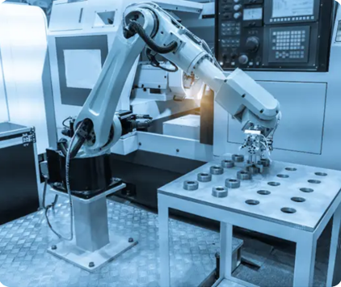
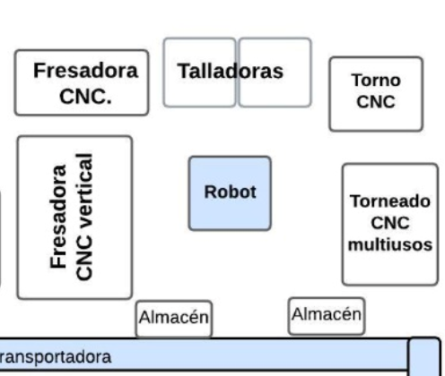

# Celda de Manufactura Robotizada

Para agilizar la producción de la planta, se plantea una celda robótica, en la cual un brazo robótico alimentará tornos CNC, fresadoras CNC y talladoras para complementar el trabajo de los operarios y lograr la fabricación de las piezas necesarias para cumplir con la producción. 

## Tipo de celda robótica

Será una celda con robot, ya que la operación principal será realizada por las diferentes máquinas que se encuentren en la celda. El robot alimentará las máquinas y en caso de que cuando termine la operación, la maquina de la operación siguiente ya esté disponible, la alimente, y en caso de que no, que se transporten para que operarios sigan con el maquinado de la pieza. El robot tendrá la posibilidad de colocar las piezas en una banda transportadora, que permitirá que la pieza llegué cerca de las estaciones de trabajo, o al almacén, para disminuir el tiempo que toma el transporte de las piezas. Se posicionarán almacenes en la celda para que disponga de suficientes piezas para iniciar su maquinado. Se llenarán los almacenes al inicio de cada turno, antes de que se ponga en funcionamiento la celda. 

## Elementos de la celda robótica

La celda contará con el robot y su respectivo controlador, el cual conectará con el PLC por medio de ethernet, para recibir las señales necesarias para realizar la alimentación de los tornos CNC, las fresadoras CNC y la talladoras. Tendrá almacenes para las piezas a maquinar y contará con bandas transportadoras. La celda no necesitará la intervención de operarios para la producción, pero sí para mantenimiento y el llenado de almacenes. Se plantea un layout en U, con el robot en el centro para que pueda alcanzar a realizar la recogida de las piezas y colocarlas en la máquina que realizará el proceso.

## Evaluación de riesgo y medidas de seguridad

### 1. Identificación de Peligros (ISO 12100)

Durante las operaciones de alistamiento, producción, mantenimiento y manipulación de piezas, se identificaron los siguientes grupos de peligros:

**1.1 Peligros mecánicos**

  - Atrapamiento y corte en bandas transportadoras y mecanismos de las máquinas CNC.
  
  - Aplastamiento por colisión con el robot industrial.
  
  - Golpes o caída de piezas manipuladas por el robot.
  
  - Proyección de virutas o fragmentos durante operaciones de mecanizado.

**1.2 Peligros eléctricos**

  - Contacto directo con componentes energizados durante mantenimiento.
  
  - Fallas de aislamiento o daños en cableado y gabinetes eléctricos.

**1.3 Peligros ergonómicos**

  - Manipulación manual de piezas durante el alistamiento.
  
  - Alcances forzados y posturas no ergonómicas dentro de la celda.

**1.4 Peligros funcionales**

  - Movimientos inesperados del robot por fallos, reinicios o errores de programación.
  
  - Falla de sensores o enclavamientos que permiten acceso mientras el robot está habilitado.

**1.5 Peligros relacionados con energía almacenada**

  - Compresores y actuadores neumáticos del gripper.
  
  - Tensión mecánica en puertas o mecanismos auxiliares.

### 2. Método de Evaluación HRN

La evaluación cuantitativa se realizó con el método Hazard Rating Number, el cual considera:

  - NP (Número de personas expuestas): 2
  
  - FE (Frecuencia de exposición): diaria → 2.5
  
  - LO (Probabilidad de ocurrencia): según condición del peligro
  
  - DPH (Severidad del daño potencial): según tipo de lesión posible

La fórmula utilizada:
HRN = NP × FE × LO × DPH

### 3. Riesgos Evaluados
**3.1 Corte y atrapamiento**

  - FE = 2.5
  
  - LO = 1 (muy improbable con cercado)
  
  - NP = 2
  
  - DPH = 6 (lesión grave: pérdida parcial de extremidad)
HRN = 30 → Riesgo Bajo–Medio

**3.2 Aplastamiento por robot**

  - FE = 2.5
  
  - LO = 1.5 (improbable, pero posible por falla del interlock)
  
  - NP = 2
  
  - DPH = 15 (lesión severa o fatal)
HRN = 112.5 → Riesgo Alto

**3.3 Riesgo eléctrico**

  - FE = 2.5
  
  - LO = 1.5 (vulnerabilidad durante mantenimiento)
  
  - NP = 2
  
  - DPH = 10 (quemaduras severas o electrocución)
HRN = 70 → Riesgo Medio

### 4. Medidas de Seguridad Implementadas

Las medidas de mitigación fueron seleccionadas siguiendo la jerarquía de control definida en ISO 12100: controles de ingeniería, dispositivos de protección, medidas administrativas y EPP.

**4.1 Controles de ingeniería**

• Cercado perimetral de la celda

Estructura metálica con puertas equipadas con interlocks de seguridad PL d–e, evitando acceso durante operación automática.

• Enclavamiento y control de acceso

El robot se detiene de manera segura si cualquier puerta es abierta. Se utiliza restart inhibit para evitar reinicios automáticos.

• Funciones de seguridad del robot (ISO 10218-1)

  - STO (Safe Torque Off)
  
  - SLS (Safe Limited Speed) para programación
  
  - Safe Zones / Safe Position para limitar movimientos
Estas funciones reducen el riesgo de aplastamiento.

• Protección en transportadores

Guardas físicas en puntos de atrapamiento y pulsadores de paro de emergencia cercanos.

• Protección eléctrica (IEC 60204-1)

Gabinetes cerrados IP55, sistemas de puesta a tierra, protección diferencial y mantenimiento preventivo.

• Señalización

Indicadores luminosos y rótulos de advertencia sobre atrapamiento, corte y operación automática.

**4.2 Medidas administrativas**

  - Procedimientos de ingreso seguro a la celda.
  
  - Protocolos de bloqueo y etiquetado (LOTO) durante mantenimiento.
  
  - Capacitación del personal en manipulación de robots industriales.
  
  - Lista de verificación previa a la puesta en marcha.
  
  - Acceso restringido a personal autorizado.

**4.3 Equipo de protección personal**

  - Guantes anticorte.
  
  - Protector ocular.
  
  - Calzado de seguridad con puntera reforzada.

### 5. Evaluación del Riesgo Residual

Tras implementar todas las medidas mencionadas, se reevaluó el nivel de peligrosidad de cada riesgo.

Los peligros de corte y atrapamiento se reducen a un nivel bajo, ya que la instalación de guardas, señalización y acceso controlado elimina casi por completo la posibilidad de contacto directo con zonas peligrosas.

El riesgo de aplastamiento por interacción con el robot, inicialmente clasificado como alto debido a la severidad del daño potencial, disminuye de manera significativa a un riesgo bajo-aceptable gracias al uso de enclavamientos, cercado perimetral, funciones STO y restricciones de movimiento dentro de la celda.

El riesgo eléctrico, originalmente de nivel medio, se reduce a bajo mediante gabinetes protegidos, procedimientos LOTO y mantenimiento preventivo constante.

En conjunto, los riesgos residuales obtenidos se encuentran dentro de los niveles aceptables para sistemas de automatización industrial, cumpliendo con los requisitos de ISO 12100 e ISO 10218-2.

