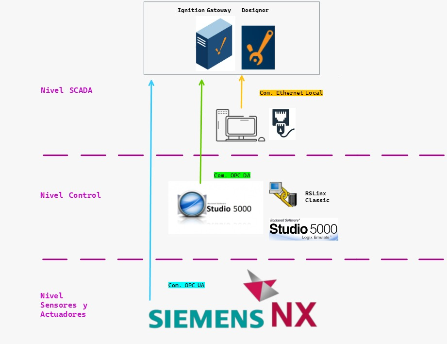

# Automatización e Industria 4.0

La Industria 4.0 integra tecnologías avanzadas y métodos de organización que permiten optimizar la producción, mejorar la eficiencia y obtener datos del proceso en tiempo real. Su aplicación incluye el uso de robots para operaciones continuas, sistemas IoT para captura de información, análisis mediante IA y modelos virtuales capaces de simular el comportamiento de la planta antes de realizar cambios en el sistema real.

Nuestra propuesta adopta este enfoque a través de los niveles de la pirámide de automatización:

* Nivel de campo: se integran sensores, actuadores y la celda robótica, responsables de ejecutar las operaciones automáticas del proceso.

* Nivel de control: un PLC coordina la secuencia de producción y sincroniza los dispositivos involucrados.

* Nivel de supervisión: un sistema SCADA permite visualizar en tiempo real el estado de las máquinas, variables críticas y trazabilidad del proceso.

* Gemelo digital: se desarrolla un modelo virtual que simula la línea de producción, útil para evaluar condiciones operativas, anticipar fallos y probar ajustes sin intervenir la planta física. reducir tiempos muertos, optimizar el uso de recursos, mejorar la planificación productiva y avanzar hacia un entorno de manufactura inteligente, alineado con los principios de la Industria 4.0.

## Arquitectura de Comunicaciones

La arquitectura del sistema se organiza en tres niveles: sensores y actuadores, control y supervisión. Cada uno se comunica mediante protocolos industriales específicos, como se muestra en la imagen adjunta.

1. **Nivel Sensores y Actuadores – Siemens NX** 

En este nivel se encuentra Siemens NX, utilizado como entorno de simulación y digital twin.
NX genera señales equivalentes a un sistema físico: lecturas de sensores, posiciones, estados y eventos del proceso. Toda esta información se envía al nivel superior mediante OPC UA, un protocolo seguro y multiplataforma que permite que el digital twin funcione como un dispositivo real dentro de la red industrial.

2. **Nivel Control – Studio 5000 y Studio 5000 Emulate**

Este nivel ejecuta la lógica del proceso utilizando Studio 5000 para la programación del PLC y Studio 5000 Emulate para simular el comportamiento del controlador sin hardware físico.
Aquí residen las secuencias, temporizadores y condiciones lógicas que gestionan el proceso.
Los datos de este nivel se exponen hacia el SCADA mediante OPC DA (OPC Classic), a través de un servidor como RSLinx, que permite publicar los tags del PLC para su monitoreo.

3. **Nivel SCADA – Supervisión e Historian**

En este nivel se ubica la plataforma SCADA, encargada de la visualización del proceso, gestión de alarmas e historización de variables.
El SCADA recibe información tanto del PLC (vía OPC DA) como del digital twin (vía OPC UA), integrando datos del sistema real y del modelo virtual en una misma interfaz.
Además, se comunica por Ethernet local con estaciones de ingeniería y terminales HMI para mantenimiento, ajustes y seguimiento técnico.

