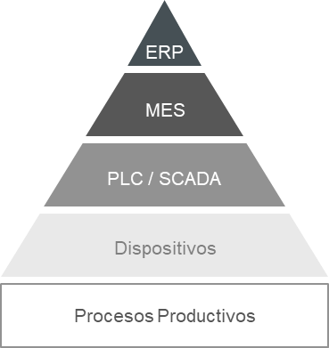

# Implementación Industria 4.0

La industria 4.0 propone la implementación de tecnologías avanzadas junto a estrategias de organización para lograr que los procesos de producción se realicen de una forma más eficiente. De esta manera, las industrias avanzan hacia una mayor tecnificación, permitiendo monitorear y obtener datos de la producción en tiempo real. El uso de robots para trabajo continuo y menores tiempos de producción, uso de IA para analizar los datos de la producción o demanda a futuro, Internet de las cosas (IoT) para la obtención de datos de planta, el desarrollo y uso de modelos digitales para simular el funcionamiento de la planta e indicadores de producción de la planta, entre otros, son ejemplos de cómo se pueden implementar las nuevas tecnologías para mejorar indicadores de producción y mejorar la organización de la empresa. 

Nuestra propuesta se alinea con este enfoque mediante la exploración de los diferentes niveles de la pirámide de automatización:

- En el nivel de campo, se integran sensores, actuadores y la celda robótica, que permiten la ejecución automatizada de operaciones de mecanizado.

- En el nivel de control, se implementa un PLC encargado de coordinar el proceso de producción y garantizar su sincronización.

- En el nivel de supervisión, se desarrolla un sistema SCADA, que permitirá monitorear en tiempo real el estado de las máquinas, las variables críticas del proceso y la trazabilidad de la producción.

Adicionalmente, se plantea el desarrollo de un gemelo digital de la línea de producción. Este modelo virtual permitirá simular condiciones operativas, predecir fallos y evaluar cambios de diseño o parámetros, anticipando su efecto sobre los indicadores de desempeño sin afectar la operación real.

Con esta integración tecnológica, se espera poder reducir tiempos muertos, optimizar el uso de recursos, mejorar la planificación productiva y avanzar hacia un entorno de manufactura inteligente, alineado con los principios de la Industria 4.0.

