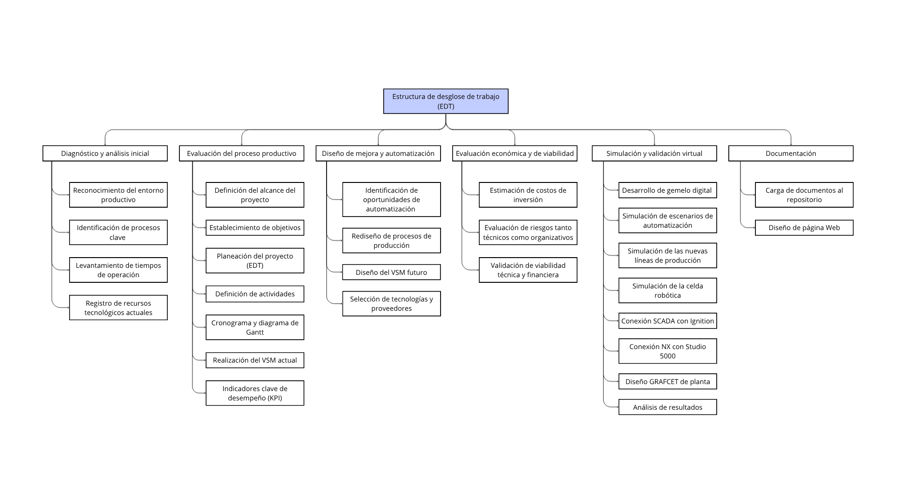
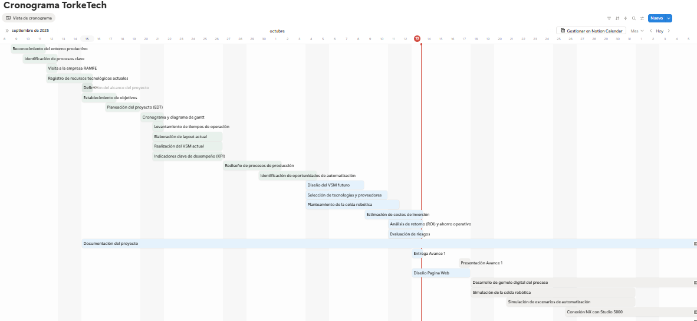

# Planeación y Evaluación de proyectos

## Definición del proyecto

El proceso de fabricación de motorreductores en una empresa de referencia como RAMFE presenta actualmente una baja integración de sistemas automatizados, con un alto grado de operaciones manuales que pueden generar ineficiencias operativas, variabilidad en la calidad del producto y limitaciones en la trazabilidad del proceso productivo. La ausencia de una arquitectura de control y supervisión unificada dificulta la gestión eficiente de la producción y retrasa la detección temprana de fallas o desviaciones.

Por ello, se plantea la necesidad de implementar una solución de automatización integral que combine control, robotización y monitoreo digital, orientada a optimizar la productividad, reducir los errores humanos y asegurar la estabilidad y consistencia del proceso de fabricación.

## Objetivos

### Objetivo general
- Diseñar y simular una solución de automatización para la fabricación de motorreductores, que incremente la productividad y eficiencia mediante sistemas de control, robótica y supervisión digital, con una meta de producción de 500 unidades mensuales de los tipos sin fin-corona, de engranajes cónicos y helicoidales.

### Objetivos específicos
- Analizar el proceso actual de manufactura de motorreductores, identificando las etapas críticas y los cuellos de botella que puedan ser mejorados mediante automatización.
- Seleccionar y diseñar tres etapas del proceso susceptibles de automatización, incluyendo al menos una con participación de una celda robotizada.
- Modelar y simular la línea de producción antes y después de la automatización mediante herramientas digitales (VSM, simuladores de planta, RobotStudio, Siemens NX).
- Implementar la lógica de control secuencial en controladores industriales (PLC/PAC) y desarrollar la programación asociada (Grafcet y Ladder).
- Desarrollar una interfaz SCADA en Ignition para la supervisión, control y registro de variables clave del proceso.
- Evaluar económicamente la propuesta mediante indicadores financieros como ROI, VPN, TIR y Payback para determinar su viabilidad.

## Estructura de Desglose del Trabajo (EDT)

## Cronograma del proyecto (Diagrama de Gannt) 

El cronograma del proyecto se gestiono en la aplicación Notion. Esta plataforma fue seleccionada por su capacidad para facilitar el control y seguimiento detallado de las actividades, incluyendo la asignación de responsabilidades, el estado de ejecución (tareas por hacer) y la definición de la prioridad o grado de importancia.

El acceso al diagrama interactivo y a la información actualizada del cronograma está disponible a través del siguiente enlace:

https://www.notion.so/2892871856e580928ec8ce7f015ae57f?v=2892871856e580338b6d000c48414374&source=copy_link

Una representación visual del cronograma se presenta a continuación:

