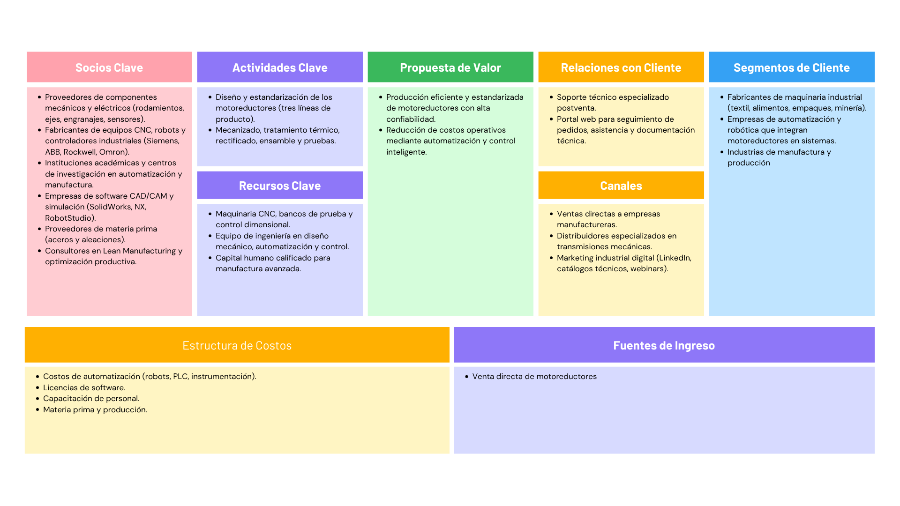

# Planeación y Evaluación de proyectos

## Definición del proyecto

El proceso de fabricación de motorreductores en RAMFE presenta una baja integración de sistemas automatizados, con operaciones manuales que generan ineficiencias, variabilidad en la calidad y limitaciones en la trazabilidad del proceso.
La ausencia de una arquitectura de control y supervisión unificada impide una gestión efectiva de la producción y la detección temprana de fallas.
Por ello, se requiere implementar una solución de automatización integral que integre control, robotización y monitoreo digital para optimizar la productividad, reducir errores y garantizar la estabilidad del proceso.

## Objetivos

### Objetivo general
- Diseñar, simular y validar una solución integral de automatización industrial para el proceso de fabricación de motorreductores en RAMFE, que incremente la productividad y eficiencia de la línea de producción mediante la implementación de sistemas de control, robótica y supervisión digital.

### Objetivos específicos
- Analizar el proceso actual de manufactura de motorreductores, identificando las etapas críticas y los cuellos de botella que puedan ser mejorados mediante automatización.
- Seleccionar y diseñar tres etapas del proceso susceptibles de automatización, incluyendo al menos una con participación de una celda robotizada.
- Modelar y simular la línea de producción antes y después de la automatización mediante herramientas digitales (VSM, simuladores de planta, RobotStudio, Siemens NX).
- Implementar la lógica de control secuencial en controladores industriales (PLC/PAC) y desarrollar la programación asociada (Grafcet y Ladder).
- Desarrollar una interfaz SCADA en Ignition para la supervisión, control y registro de variables clave del proceso.
- Evaluar económicamente la propuesta mediante indicadores financieros como ROI, VPN, TIR y Payback para determinar su viabilidad.

## Estructura de Desglose del Trabajo (EDT)

## Cronograma del proyecto (Diagrama de Gannt) 

El cronograma del proyecto se gestiono en la aplicación Notion. Esta plataforma fue seleccionada por su capacidad para facilitar el control y seguimiento detallado de las actividades, incluyendo la asignación de responsabilidades, el estado de ejecución (tareas por hacer) y la definición de la prioridad o grado de importancia.

El acceso al diagrama interactivo y a la información actualizada del cronograma está disponible a través del siguiente enlace:

https://www.notion.so/2892871856e580928ec8ce7f015ae57f?v=2892871856e580338b6d000c48414374&source=copy_link

Una representación visual del cronograma se presenta a continuación:

## Hoja de Excel donde se determine presupuesto de adquisiciones, costos del proyecto y flujos de caja.

## Hoja Excel en donde se evidencie los indicadores ROI, VPN, TIR y Payback como sustento para ver si el proyecto es económicamente viable.

## Actas firmadas por los integrantes del equipo. (Acta de inicio, actas de reuniones etc)

## Modelo de negocio. (Modelo Canva de propuesta de valor)

## Oferta comercial de la propuesta de automatización.
